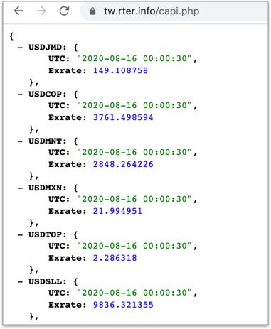
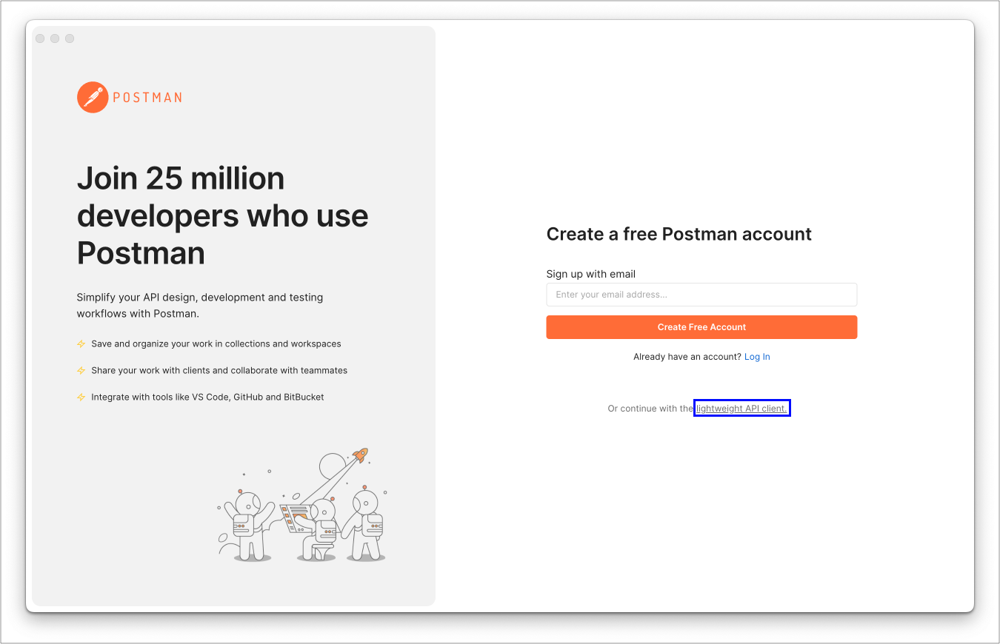

# 1.3 開發工具簡介

## 瀏覽器

課堂上以 Chrome 為主。

* [Chrome](https://www.google.com/intl/zh-TW/chrome/)
* [Firefox](https://www.mozilla.org/zh-TW/firefox/new/)
* Safari
* [Edge](https://www.microsoft.com/en-us/edge)
* [Opera](https://www.opera.com/zh-tw)

## 編輯器

* [VS Code](https://code.visualstudio.com/)

## 測試 API 的工具

### JSONVue

複製以下網址，貼到瀏覽器上看輸出：

`https://tw.rter.info/capi.php`

如下圖：

如果沒有，可到[這個網址](https://chrome.google.com/webstore/detail/jsonview/chklaanhfefbnpoihckbnefhakgolnmc)安裝，是個 Chrome 瀏覽器上的套件，方便看 JSON 資料。

### postman

下載 [Postman](https://www.postman.com/downloads/)( [https://www.postman.com/downloads/](https://www.postman.com/downloads/) )，方便進行 API 的測試與觀察。

Postman 可透過以下按鈕，跳過註冊(藍框處：`lightweight API client`)：

<figure><figcaption></figcaption></figure>

透過 postman，測試以下 API(傳送資料類型選 `GET`)：

* https://tw.rter.info/capi.php

示意圖：

## 前置

在桌面或其它自己習慣的位置，建立如下圖所示的資料夾。另 `assignment_number_ajax` 中的 `number` 請改成自己的座號：

