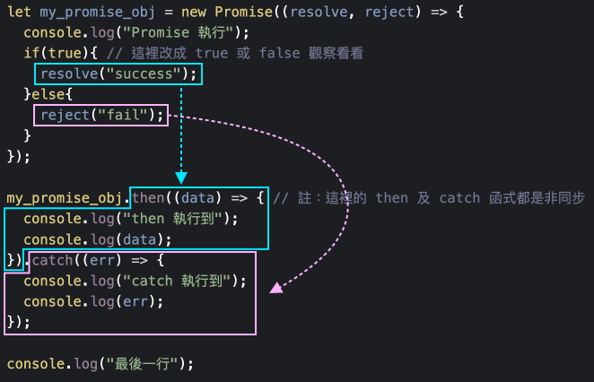

# 4.1 語法

## 初探 Promise

Promise 物件概念：與朋友約好了明天聚餐，最後只有兩種結果：

1、成功赴約聚餐。( 執行 **`resolve`** 函式 )

2、不論任何原因，無法赴約。(執行 **`reject`** 函式)

語法流程示意：

<figure><figcaption></figcaption></figure>

程式語法：




## 初探 async

函式使用 **`async`** 關鍵字：

* 該函式總是會回傳 **`resolved promise`**。
* 該函式內部可使用 **`await`** 關鍵字。

程式語法：




## fetch 語法

一、以下語法當中的**第一個 then** 的箭頭函式：得到的是一個 **Response 的物件**，主要包含**表頭資訊(headers)**，主要是用來**判斷跟遠端的伺服器是不是連線都正常**(使用 **`res.ok`** 來判斷)。如果 res.ok 得到 true，再透過 **`res.json()`** 函式，來解析後端的資料，然後資料會帶到下一個 then。

二、**第二個 then** 的箭頭函式：**`data`** 印出來看，會得到後端回傳的資料。


### 串接 API 類型為 GET

```javascript
fetch("API 網址").then((res) => {
  if(res.ok){
    return res.json();
  }
}).then((data) => {
  console.log(data); // 後端回傳的資料，這裡取得
});
```

或者直接寫：

```javascript
fetch("API 網址").then(res => res.json()).then(data => {
  console.log(data);
});
```


### 串接 API 類型為非 GET

與上例的差異，只在於代入第二個參數：

```javascript
fetch("API 網址", {
  method: "POST", // POST | PUT | PATCH | DELETE
  body: 資料      // 欲傳送的資料
}).then // 這裡省略不寫，同上述 GET 的部份。
```

body 常用的`資料`格式：

* **`JSON.stringify(JSON格式)`**：JSON 格式字串化。
* **`FormData`**：Content-Type 會自動是 「 **`multipart/form-data`** 」，可傳遞檔案類型。
* **`URLSearchParams(FormData)`**：Content-Type 會自動是 「 **`x-www-form-urlencoded`** 」，不可傳遞檔案類型。


## async 與 await

只能在 **ESM 模組**或 **async function** 當中使用。這裡僅針對 async function 做使用，僅能在 async function 中使用 await 關鍵字。

以 GET 為例：

```javascript
function test_func(){

  fetch("API 網址").then(res => res.json()).then(data => {
    console.log(data);
  });
  
}
```

等同於：

```javascript
async function test_func(){

  let res = await fetch("API 網址"); // 若是非 GET，再加第二個參數
  let data = await res.json();
  
}
```

